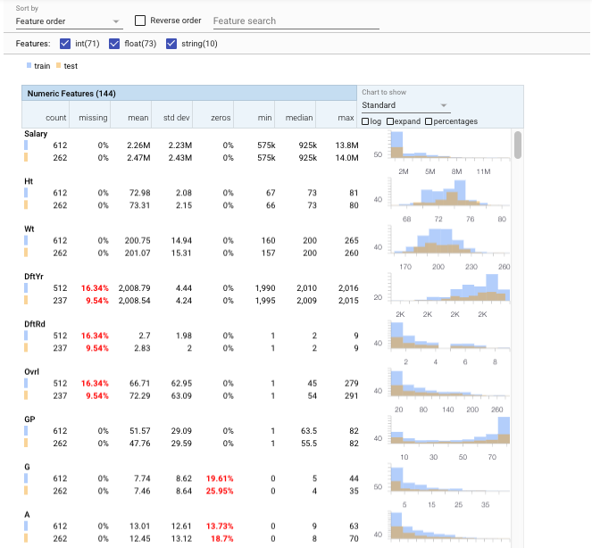
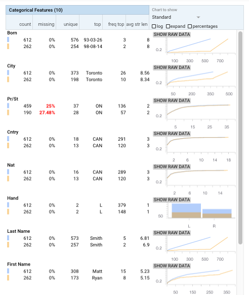

### Visualizing Machine Learning Datasets using Anaconda & Facets
Facets allows for easy visualization. For using Facets, first clone the git repository:

> git clone https://github.com/PAIR-code/facets.git

To use the visualization capabilities, you will have to add an nbextension. Therefore, find the path to the facets-dist directory in the cloned git repo and execute the following line of code:

> jupyter nbextension install facets-dist/ --user

In which case 'facets-dist' is the path to the respective folder. 

If the above command still does not show the visualizations on the notebook, copy the file called facets-jupyter.html in 'facets/facets-dist' folder your local anaoconda file path _'[anaconda_path]/share/jupyter/nbextensions/'_. This is a known issue https://github.com/PAIR-code/facets/issues/41

You might need to restart jupyter after this and proceed with the vizualisation. For a more detailed installation guide and updates, have a look at:

> https://github.com/PAIR-code/facets

Do also install the protobuf package

> conda install protobuf


```python
# Add the facets overview python code to the python path
import sys
# FACETS_PATH is the full path to the python file in the clonde github repo of Facets.
# It should look similar to this: ".../facets/facets_overview/python"
# If you have cloned the facets repo to your current working directory, you can proceed.
# If you have chosen another location, just add it here.

FACETS_PATH = 'facets-master/facets_overview/python'
sys.path.append(FACETS_PATH)
```


```python
import pandas as pd

train_data = pd.read_csv(
    "train.csv",
    #sep=r'\s*,\s*',
    engine='python',
    na_values="?")

test_data = pd.read_csv(
    "test.csv",
    #sep=r'\s*,\s*',
    engine='python',
    na_values="?")

test_salaries = pd.read_csv(
    "test_salaries.csv",
    #sep=r'\s*,\s*',
    engine='python',
    na_values="?")

test_data = pd.concat([test_salaries, test_data], axis=1)
```


```python
# Calculate the feature statistics proto from the datasets and stringify it for use in 
# facets overview
from generic_feature_statistics_generator import GenericFeatureStatisticsGenerator
import base64

gfsg = GenericFeatureStatisticsGenerator()
proto = gfsg.ProtoFromDataFrames([{'name': 'train', 'table': train_data},
                                  {'name': 'test', 'table': test_data}])
protostr = base64.b64encode(proto.SerializeToString()).decode("utf-8")
```


```python
# Display the facets overview visualization for this data
from IPython.core.display import display, HTML

HTML_TEMPLATE = """<link rel="import" href="/nbextensions/facets-dist/facets-jupyter.html" >
        <facets-overview id="elem"></facets-overview>
        <script>
          document.querySelector("#elem").protoInput = "{protostr}";
        </script>"""

html = HTML_TEMPLATE.format(protostr=protostr)
display(HTML(html))
```





Facets Overview provides a quick understanding of the distribution of values across the features of their datasets. Multiple datasets, such as a training set and a test set, can also be compared on the same visualization. 

Common data issues that can hamper machine learning are pushed to the forefront, such as: unexpected feature values, features with high percentages of missing values, features with unbalanced distributions, and feature distribution skew between datasets.

### Known Issues ###

The Facets visualizations currently work only in Chrome browsers
